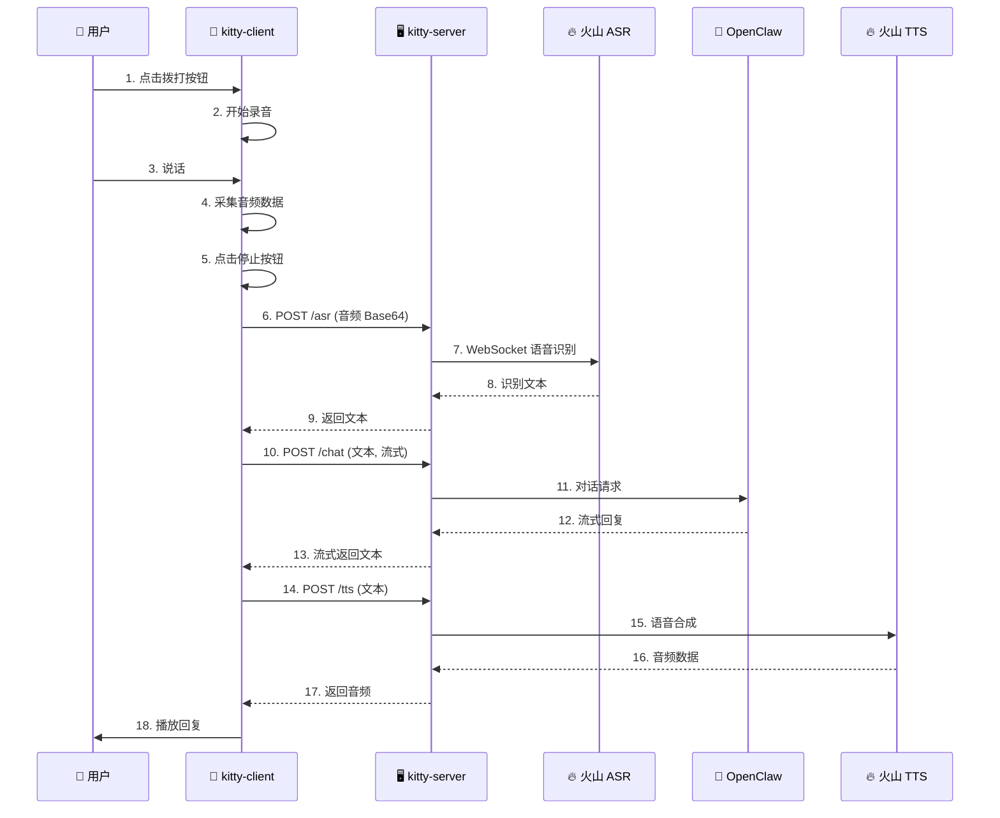

# 🐱 Kitty - 技术实施方案 v3.0

> 个人专属 7×24 小时语音 Agent 系统
> 创建时间：2026-03-21
> 版本：v3.0
> 最后更新：2026-04-04

---

## 📖 目录

1. [需求描述](#1-需求描述)
2. [整体架构](#2-整体架构)
3. [项目结构](#3-项目结构)
4. [kitty-server 服务端](#4-kitty-server-服务端)
5. [kitty-client iOS 客户端](#5-kitty-client-ios-客户端)
6. [本地调试步骤](#6-本地调试步骤)
7. [成本估算](#7-成本估算)

---

## 1. 需求描述

### 1.1 项目背景

打造一个**个人专属的 7×24 小时语音 Agent 系统**，实现类似豆包 App 的语音通话体验。

### 1.2 核心需求

| 编号 | 需求 | 优先级 |
|------|------|--------|
| F1 | iOS App 一键拨打"热线电话" | P0 |
| F2 | 实时语音对话 | P0 |
| F3 | 语音识别（ASR） | P0 |
| F4 | 语音合成（TTS） | P0 |
| F5 | LLM 对话核心（OpenClaw） | P0 |
| F6 | 低延迟 | P1 |

### 1.3 技术选型

| 模块 | 选型 | 说明 |
|------|------|------|
| **ASR** | 火山引擎 豆包大模型语音识别 | WebSocket API |
| **TTS** | 火山引擎 TTS | HTTP API |
| **LLM** | OpenClaw | 与小龙虾同机部署 |
| **服务端** | Python + FastAPI | HTTP API |
| **iOS 客户端** | Swift + SwiftUI | 原生开发 |

---

## 2. 整体架构

### 2.1 架构图

```
┌─────────────────────────────────────────────────────────────────┐
│                        kitty-client (iOS)                       │
│  ┌─────────────┐     ┌──────────────────┐     ┌─────────────┐  │
│  │  音频采集    │     │ ConversationMgr  │     │  音频播放   │  │
│  │  (AVAudio)  │────→│                  │────→│ (AVAudio)  │  │
│  └─────────────┘     └────────┬─────────┘     └─────────────┘  │
└───────────────────────────────┼─────────────────────────────────┘
                                │ HTTP
                                ↓
┌─────────────────────────────────────────────────────────────────┐
│                      kitty-server (Python)                      │
│  ┌─────────────┐     ┌──────────────────┐     ┌─────────────┐  │
│  │  /asr API   │     │  /chat API       │     │  /tts API   │  │
│  │  语音识别   │     │  对话生成        │     │  语音合成   │  │
│  └──────┬──────┘     └────────┬─────────┘     └──────┬──────┘  │
└─────────┼─────────────────────┼──────────────────────┼─────────┘
          │ WebSocket           │ HTTP                 │ HTTP
          ↓                     ↓                      ↓
┌─────────────────┐    ┌─────────────────┐    ┌─────────────────┐
│   火山引擎 ASR   │    │   OpenClaw      │    │   火山引擎 TTS  │
│  (语音识别)     │    │   (LLM)         │    │   (语音合成)    │
└─────────────────┘    └─────────────────┘    └─────────────────┘
```

### 2.2 数据流



### 2.3 API 设计

| 接口 | 方法 | 说明 |
|------|------|------|
| `/asr` | POST | 语音识别，接收音频 Base64，返回文本 |
| `/chat` | POST | 对话，流式返回文本，支持会话记忆 |
| `/tts` | POST | 语音合成，接收文本，返回音频 |
| `/session/{id}` | GET | 获取会话历史 |
| `/session/{id}` | DELETE | 清空会话 |

### 2.4 会话管理架构

```
┌─────────────────────────────────────────────────────────┐
│                    kitty-server                         │
│  ┌─────────────────────────────────────────────────┐   │
│  │           Sessions Manager (备份)                │   │
│  │  ┌──────────┐  ┌──────────┐  ┌──────────┐      │   │
│  │  │ session_1│  │ session_2│  │ session_n│      │   │
│  │  │ messages │  │ messages │  │ messages │      │   │
│  │  │  [20条]  │  │  [20条]  │  │  [20条]  │      │   │
│  │  └──────────┘  └──────────┘  └──────────┘      │   │
│  └─────────────────────────────────────────────────┘   │
│                         │                               │
│                         ▼                               │
│              ┌──────────────────┐                       │
│              │   OpenClaw API   │                       │
│              │  model: main     │                       │
│              │  session_id: main│ ← 使用 OpenClaw 的    │
│              │  + messages[]    │   main session        │
│              └──────────────────┘                       │
└─────────────────────────────────────────────────────────┘
```

**会话记忆实现**：
1. **使用 OpenClaw main session** - 传递 `session_id: "main"` 给 OpenClaw API
2. **服务端备份历史** - 作为备份和日志，保存最近 20 条消息
3. **双重保障** - OpenClaw session + 服务端历史，确保记忆不丢失
4. **一致性** - 每次对话都使用 OpenClaw 的 main agent 和 main session

---

## 3. 项目结构

```
Kitty-Cloud/
├── kitty-client/                 # iOS 客户端
│   ├── Kitty/
│   │   ├── App/
│   │   │   ├── KittyApp.swift    # 入口
│   │   │   └── AppDelegate.swift # 音频会话配置
│   │   ├── Config/
│   │   │   └── APIConfig.swift   # 配置
│   │   ├── Services/
│   │   │   ├── KittyService.swift        # 后端 API 调用
│   │   │   └── ConversationManager.swift # 对话管理
│   │   ├── Views/
│   │   │   ├── CallView.swift    # 通话界面
│   │   │   └── SettingsView.swift# 设置界面
│   │   ├── Info.plist
│   │   └── ...
│   ├── Kitty.xcodeproj/
│   └── Podfile
│
├── kitty-server/                 # Python 服务端
│   ├── main.py                   # FastAPI 服务
│   ├── requirements.txt          # Python 依赖
│   └── .venv/                    # Python 虚拟环境
│
├── 技术方案.md
└── README.md
```

---

## 4. kitty-server 服务端

### 4.1 依赖安装

```bash
cd kitty-server
uv venv
source .venv/bin/activate
uv pip install -i https://pypi.tuna.tsinghua.edu.cn/simple fastapi uvicorn httpx websockets
```

### 4.2 启动服务

```bash
source .venv/bin/activate
python main.py
# 服务运行在 http://localhost:8080
```

### 4.3 API 接口

#### POST /asr - 语音识别

**请求**:
```json
{
    "audio": "<base64-encoded-audio>",
    "format": "wav"
}
```

**响应**:
```json
{
    "text": "你好"
}
```

#### POST /chat - 对话（流式）

**请求**:
```json
{
    "message": "今天天气怎么样",
    "history": []
}
```

**响应**: 流式文本

#### POST /tts - 语音合成

**请求**:
```json
{
    "text": "你好，我是Kitty",
    "voice": "zh_female_wenrou_moon_bigtts"
}
```

**响应**: MP3 音频数据

### 4.4 配置说明

在 `main.py` 中修改以下配置：

```python
# OpenClaw 配置
OPENCLAW_URL = "http://localhost:18789"
OPENCLAW_TOKEN = "your-token"

# 火山引擎配置
VOLC_ASR_APP_ID = "your-app-id"
VOLC_ASR_TOKEN = "your-token"
VOLC_TTS_APP_ID = "your-app-id"
VOLC_TTS_TOKEN = "your-token"
```

---

## 5. kitty-client iOS 客户端

### 5.1 环境要求

- Xcode 15+
- iOS 15+
- Swift 5+

### 5.2 打开项目

```bash
cd kitty-client
open Kitty.xcworkspace
```

### 5.3 配置服务器地址

在设置界面修改服务器地址，默认为 `http://localhost:8080`。

### 5.4 运行

1. 选择模拟器或真机
2. Cmd+R 运行

---

## 6. 本地调试步骤

### 6.1 启动 OpenClaw

确保 OpenClaw 服务已启动，运行在 `http://localhost:18789`

### 6.2 启动 kitty-server

```bash
cd kitty-server
source .venv/bin/activate
python main.py
```

### 6.3 运行 kitty-client

```bash
cd kitty-client
open Kitty.xcworkspace
# 在 Xcode 中运行
```

### 6.4 测试流程

| 步骤 | 操作 | 预期结果 |
|------|------|---------|
| 1 | 启动 kitty-server | 服务运行在 8080 端口 |
| 2 | 运行 iOS App | 显示通话界面 |
| 3 | 点击绿色按钮 | 开始录音 |
| 4 | 说话后点击红色按钮 | 显示识别文本 |
| 5 | 等待回复 | 显示助手回复并播放语音 |

---

## 7. 成本估算

### 7.1 火山引擎费用

| 使用强度 | ASR 用量 | TTS 用量 | 月费用 |
|---------|---------|---------|--------|
| 轻度（每天 10 分钟） | 5 小时 | 15 万字符 | ¥0（免费内） |
| 中度（每天 30 分钟） | 15 小时 | 45 万字符 | ¥0（免费内） |
| 重度（每天 2 小时） | 60 小时 | 180 万字符 | ¥40-60 |

**免费额度**：
- ASR：50 小时/月
- TTS：100 万字符/月

---

## 📝 版本历史

| 版本 | 日期 | 说明 |
|------|------|------|
| v1.0 | 2026-03-21 | 初版方案 |
| v2.0 | 2026-03-21 | iOS App 直连火山 SDK |
| v3.0 | 2026-04-04 | **新架构**：kitty-server 服务端 + kitty-client 客户端，更稳定可靠 |

---

> 🐱 **Kitty**：新架构将复杂的语音处理逻辑移到服务端，客户端更简洁，调试更方便！