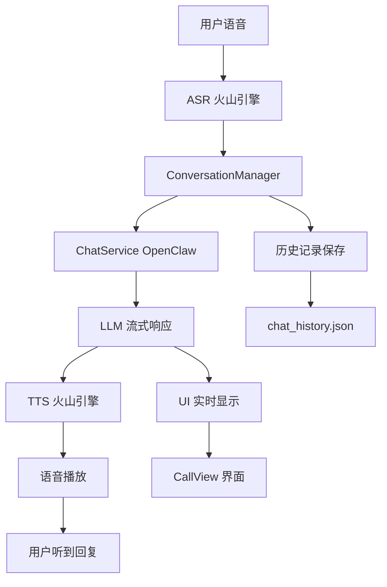

# Kitty - iOS 语音对话助手

## 项目概述

Kitty 是一个 iOS 语音对话助手应用，通过集成火山引擎 ASR/TTS 和 OpenClaw LLM，实现端到端的语音交互体验。用户可以通过语音与 AI 助手进行自然对话，支持流式响应和实时语音播放。

**版本**: 2.1
**开发时间**: 2026-03-31 - 2026-04-04

---

## 核心功能

### 1. 语音通话
- **一键通话**: 点击绿色按钮开始对话
- **实时识别**: ASR 实时转写用户语音为文字
- **流式响应**: LLM 流式生成回复，实时显示
- **语音播放**: TTS 实时播放 AI 回复
- **状态可视化**: 显示监听、思考、回复等状态

### 2. 对话管理
- **历史记录**: 自动保存所有对话到本地文件
- **历史查看**: 设置中可查看完整对话历史
- **清空记录**: 支持一键清空历史消息
- **多轮对话**: 支持上下文记忆和连续对话

### 3. 音色选择
- 6 种预设音色：
  - VV 女声
  - 温柔女声
  - 爽快女声
  - 沉稳男声
  - 清新女声
  - 青年男声

### 4. API 配置
- 可配置 OpenClaw 网关地址
- 支持 localhost 和局域网 IP
- 自动保存 API Token 和认证信息

---

## 技术架构



### 技术栈

| 组件 | 技术 | 说明 |
|------|------|------|
| UI 框架 | SwiftUI | iOS 原生界面 |
| ASR | 火山引擎 | 豆包流式语音识别模型 2.0 |
| TTS | 火山引擎 | 火山引擎 TTS HTTP API |
| LLM | OpenClaw | OpenAI 兼容 API，流式响应 |
| 状态管理 | Combine | @Published + ObservableObject |
| 数据持久化 | JSON 文件 | 本地历史记录 |

---

## 核心组件

### 1. CallView (主界面)
**文件**: `Kitty/Views/CallView.swift`

**职责**:
- 显示通话状态（待机、监听、思考、回复）
- 通话按钮控制
- 实时对话文字显示
- 音频波形可视化
- 错误信息提示

**关键状态**:
```swift
enum ConversationState: String {
    case idle = "待机"
    case listening = "监听中"
    case thinking = "思考中"
    case speaking = "回复中"
    case error = "错误"
}
```

### 2. ConversationManager (对话管理)
**文件**: `Kitty/Services/ConversationManager.swift`

**职责**:
- 整合 ASR、LLM、TTS 三个服务
- 管理对话状态流转
- 处理用户输入和 AI 回复
- 控制打断和重新监听

**流程**:
1. 开始对话 → 启动 ASR 监听
2. ASR 完成 → 调用 LLM 流式对话
3. LLM 返回片段 → 实时 TTS 播放
4. TTS 完成 → 回到监听状态

### 3. ChatService (LLM 服务)
**文件**: `Kitty/Services/ChatService.swift`

**职责**:
- 连接 OpenClaw OpenAI 兼容 API
- 流式请求和响应处理（SSE 格式）
- 多轮对话上下文管理
- 历史消息持久化

**关键配置**:
```swift
request.setValue("Bearer \(ServerConfig.apiToken)", forHTTPHeaderField: "Authorization")
request.setValue("operator.write,operator.read", forHTTPHeaderField: "x-openclaw-scopes")
request.setValue("kitty", forHTTPHeaderField: "x-openclaw-session-id")
request.setValue(deviceId, forHTTPHeaderField: "x-openclaw-device-id")
```

**流式响应处理**:
- 解析 SSE 格式: `data: {...}`
- 实时提取 `delta.content`
- 支持取消请求
- 错误处理和超时

### 4. SpeechEngineManager (语音引擎)
**文件**: `Kitty/Services/SpeechEngineManager.swift`

**职责**:
- 管理 ASR WebSocket 连接
- 管理 TTS HTTP 请求
- 流式 TTS 播放（实时合成）
- 音频级别监听（波形显示）

**WebSocket ASR**:
- 连接地址: `wss://openspeech.bytedance.com/api/v3/sauc/bigmodel`
- 实时发送音频数据
- 接收识别结果
- 处理结束信号

**HTTP TTS**:
- 地址: `https://openspeech.bytedance.com/api/v1/tts`
- 接收文本片段
- 合成音频
- 实时播放

### 5. SettingsView (设置界面)
**文件**: `Kitty/Views/SettingsView.swift`

**职责**:
- API 地址配置
- 音色选择
- 历史消息查看
- 清空历史记录

**集成 HistoryView**:
- 显示所有对话历史
- 按角色区分（用户 👤 / 助手 🐱）
- 显示时间戳
- 支持清空功能

---

## 配置说明

### 1. APIConfig.swift
**文件**: `Kitty/Config/APIConfig.swift`

#### 火山引擎配置
```swift
struct VolcConfig {
    // ASR 凭证
    static let asrAppId = "3214571057"
    static let asrToken = "RSi0XcS9HHmyVMcvhie9-yDo_tIxRWE0"
    static let asrResourceId = "volc.seedasr.sauc.duration"

    // TTS 凭证
    static let ttsAppId = "3214571057"
    static let ttsToken = "RSi0XcS9HHmyVMcvhie9-yDo_tIxRWE0"
    static let ttsResourceId = "volcano_tts"

    // 服务地址
    static let asrAddress = "wss://openspeech.bytedance.com"
    static let ttsHttpUrl = "https://openspeech.bytedance.com/api/v1/tts"
}
```

#### OpenClaw 配置
```swift
struct ServerConfig {
    // API 地址（支持 localhost 和局域网 IP）
    static let apiURL = "http://localhost:18789"

    // 认证 Token
    static let apiToken = "f894296566d6b5365d2dd6ec9b19ecb70555add6cd73b0c7"

    // 模型选择
    static let defaultModel = "openclaw/main"
}
```

### 2. 网络配置
**文件**: `Kitty/Info.plist`

```xml
<key>NSAppTransportSecurity</key>
<dict>
    <key>NSAllowsArbitraryLoads</key>
    <true/>
</dict>
```

允许 HTTP 连接（用于本地测试）

### 3. 权限配置
**文件**: `Kitty/Info.plist`

```xml
<key>NSMicrophoneUsageDescription</key>
<string>Kitty 需要使用麦克风进行语音通话</string>

<key>NSSpeechRecognitionUsageDescription</key>
<string>Kitty 需要语音识别功能来理解您的语音指令</string>

<key>UIBackgroundModes</key>
<array>
    <string>audio</string>
</array>
```

---

## 使用说明

### 开发环境设置

1. **克隆项目**
```bash
cd /path/to/Kitty-Cloud/Kitty
```

2. **安装依赖**
```bash
pod install
```

3. **配置凭证**
编辑 `Kitty/Config/APIConfig.swift`，更新：
- 火山引擎 ASR/TTS Token
- OpenClaw API Token

4. **运行项目**
```bash
# Xcode 中按 Cmd + R
# 或命令行：
xcodebuild -project Kitty.xcodeproj -scheme Kitty \
  -destination 'platform=iOS Simulator,name=iPhone 17' \
  build
xcrun simctl install "iPhone 17" Kitty.app
xcrun simctl launch "iPhone 17" com.kitty.app
```

### 模拟器网络配置

**iOS 模拟器访问宿主机服务**:
- ✅ 使用 `http://localhost:18789`
- ✅ 使用 `http://127.0.0.1:18789`
- ❌ 不要使用局域网 IP（如 192.168.31.70）

**真机访问**:
- ✅ 使用宿主机局域网 IP（如 `http://192.168.2.8:18789`）
- ✅ 确保 iPhone 和 Mac 在同一网络

### 用户使用流程

1. **启动 App**
   - 打开 Kitty，显示待机状态

2. **开始通话**
   - 点击绿色通话按钮
   - 状态变为"监听中"
   - 说话时会显示音频波形

3. **对话交互**
   - ASR 自动识别语音
   - 实时显示用户文字
   - LLM 流式生成回复
   - TTS 实时播放语音

4. **结束通话**
   - 点击红色挂断按钮
   - 状态回到待机

5. **查看历史**
   - 点击右上角齿轮图标
   - 点击"历史消息"
   - 查看所有对话记录

---

## 数据结构

### Message 模型
**文件**: `Kitty/Models/Message.swift`

```swift
struct Message: Identifiable, Codable {
    let id: UUID
    let timestamp: Date
    let role: MessageRole  // user / assistant
    let content: String
}
```

### OpenAI API 格式

**请求**:
```json
{
  "model": "openclaw/main",
  "messages": [
    {"role": "user", "content": "你好"}
  ],
  "stream": true,
  "user": "device-id"
}
```

**流式响应（SSE）**:
```
data: {"choices":[{"delta":{"content":"你"}}]}
data: {"choices":[{"delta":{"content":"好"}}]}
data: [DONE]
```

---

## 开发历程

### 问题解决记录

#### 1. API 地址配置问题
**问题**: 模拟器使用错误的 IP 地址（192.168.31.70）
**原因**:
- 模拟器应使用 localhost 访问宿主机
- 局域网 IP 无法连接

**解决**:
```swift
static let apiURL = "http://localhost:18789"  // 模拟器
// 或
static let apiURL = "http://192.168.2.8:18789"  // 真机
```

#### 2. 重新运行生效
**问题**: 修改源代码后模拟器未生效
**解决**: 需要在 Xcode 重新编译运行（Cmd + R）

#### 3. 历史消息查看
**需求**: 用户想查看历史对话记录
**实现**:
- 在 SettingsView 中添加 HistoryView
- 显示所有消息（用户 👤 / 助手 🐱）
- 支持清空功能

---

## 项目文件结构

```
Kitty/
├── App/
│   ├── KittyApp.swift          # App 入口
│   └── AppDelegate.swift       # AppDelegate
├── Config/
│   └── APIConfig.swift         # API 和凭证配置
├── Models/
│   └── Message.swift           # 消息模型和 API 响应模型
├── Services/
│   ├── ConversationManager.swift   # 对话流程管理
│   ├── ChatService.swift           # LLM API 服务
│   └── SpeechEngineManager.swift   # ASR/TTS 语音引擎
├── Views/
│   ├── CallView.swift          # 主通话界面
│   ├── SettingsView.swift      # 设置界面（含 HistoryView）
│   └── Components/
│       └ WaveformView.swift    # 音频波形组件
├── Utils/
│   └ OpenClawError.swift       # 错误类型定义
├── Info.plist                  # 权限和配置
└ └ Kitty.xcodeproj            # Xcode 项目
└── Kitty.xcworkspace           # Xcode 工作空间
```

---

## 未来优化方向

### 1. 功能增强
- 支持语音打断功能优化
- 添加多个 Agent 选择
- 支持自定义音色参数
- 添加静音检测自动停止 ASR

### 2. UI 优化
- 添加动画效果
- 优化波形显示
- 支持深色模式
- 添加引导提示

### 3. 性能优化
- 优化 WebSocket 连接稳定性
- 减少内存占用
- 优化 TTS 播放延迟

### 4. 数据管理
- 支持导出历史记录
- 添加标签和搜索功能
- 云端同步（可选）

---

## 参考文档

- [火山引擎 ASR 文档](https://www.volcengine.com/docs/6561/113643)
- [火山引擎 TTS 文档](https://www.volcengine.com/docs/6561/1739228)
- [OpenAI API 文档](https://platform.openai.com/docs/api-reference/chat)
- [SwiftUI 官方文档](https://developer.apple.com/documentation/swiftui)

---

## 开发者备注

### 关键设计决策

1. **流式架构**: 选择流式 ASR + 流式 LLM + 流式 TTS，实现端到端的实时体验
2. **单例模式**: ChatService 和 SpeechEngineManager 使用单例，便于状态共享
3. **Combine 框架**: 使用 @Published 和 ObservableObject 实现响应式 UI
4. **本地存储**: 使用 JSON 文件而非数据库，简化实现

### 注意事项

1. **Token 安全**: 生产环境应使用环境变量或加密存储 Token
2. **网络超时**: 设置合理的超时时间（ASR 120s，LLM 120s）
3. **错误处理**: 完善的错误提示和自动恢复机制
4. **权限检查**: 启动时检查麦克风和语音识别权限

---

**项目完成日期**: 2026-04-04
**最后更新**: 2026-04-04